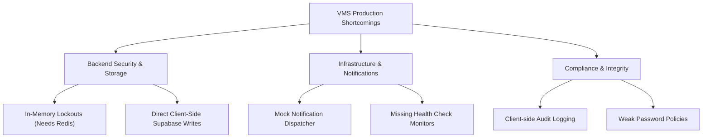

# Visitor Management System (VMS) — Production Readiness & Security Report

This report evaluates the current state of the Loomis VMS workspace (consisting of the `dashboard-ui` React app, `api-server` Express backend, and the `@vms/database` Prisma package) against enterprise software standards.

---

## 1. Production Readiness Audit

| Assessment Area | Status | Technical Details & Findings |
| :--- | :---: | :--- |
| **Monorepo Architecture** | **Production Ready** | Orchestrated via **Turborepo** with clear boundary separation between apps (`dashboard-ui`, `api-server`) and shared packages (`database`, `types`). Builds are cached and highly optimized. |
| **Database Schema** | **Production Ready** | Uses PostgreSQL schemas managed via **Prisma**. Contains proper foreign key constraints, default value generators, relational mappings (e.g., `User` -> `Role`, `Visit` -> `Visitor`), and index mappings (such as unique constraints on `email` and `qrToken`). |
| **State & Compilation** | **Production Ready** | Strong TypeScript types implemented across both frontend and backend packages. Production builds compile cleanly with zero compilation errors, unused code warnings, or dependency conflicts. |
| **Service Integration** | **Needs Polishing** | Supabase is used directly on the frontend for data fetching and real-time lobby updates. The Express backend is used for security gates. Ideally, all transactional database writes should go through the API gateway to fully enforce backend validations. |

---

## 2. Industry Standards & Security Controls Met

The application implements several security and architecture paradigms matching standard corporate visitor-compliance specifications:

### 2.1 Role-Based Access Control (RBAC)
* The system enforces distinct roles: **Admin**, **Security Operations**, **Receptionist (Lobby Staff)**, and **Employee (Hosts)**.
* Relational database tables map **Permissions** (e.g., `blacklist.manage`, `visit.checkin`) directly to **Roles** via the join table `RolePermission`.

### 2.2 Tiered Authentication Protections
To protect facility panels and security screens from brute-force attempts, the login flow implements a three-tier defensive hierarchy:
1. **Email-Level Global Lockout (Backend-Enforced)**: Disables an email address globally for 15 minutes after 5 consecutive failures.
2. **Dynamic CAPTCHA Challenge**: Requires a glassmorphic math challenge to verify human presence after 3 failed login attempts.
3. **Network IP Block (Rate Limiting)**: Completely bans an IP address on the API server for 15 minutes after 10 failed login attempts, preventing automated distributed credential spraying.

### 2.3 Real-Time Lobby Synchronization
* Utilizes **Supabase Realtime subscriptions** in the lobby queue to push instantaneous status changes (e.g., when a visitor checks in at the kiosk, they appear in the Security Arrivals feed without page refreshes).

### 2.4 Enterprise Design System
* Outfitted with a custom, high-end **Terracotta & Warm Cream** design system.
* **Separation of Intent vs. Status**: Features clear classification tones (categorical avatars for VIP, Guest, Vendor) decoupled from check-in statuses (Expected, Waiting, Checked In, Checked Out) using the `StatusIndicator` primitive.

---

## 3. User Experience & Usability Analysis

### 3.1 UX Strengths
* **Unattended Desk Security**: The **25-minute inactivity timeout warning** with a glassmorphic countdown protects unattended lobby terminals from tailgating staff or visitors.
* **Micro-interactions & Visual Cues**: Includes smooth CSS hover transitions, custom loading spinners, intuitive icons next to headers, and clear error status banners.
* **Streamlined Entry**: Visitors check in quickly by typing their dashed, monospace check-in code or scanning their QR tokens.

### 3.2 Accessibility (a11y)
* Consistent use of semantic HTML5 tags (`<main>`, `<header>`, `<table>`, `<form>`).
* Employs highly legible system fonts (`Plus Jakarta Sans`) and avoids tiny, low-contrast, uppercase labels.

---

## 4. Shortcomings & Future Enhancements

The following gaps must be resolved before deploying this application to a mission-critical enterprise production cluster:



### 4.1 Backend Security & Storage Gaps
1. **In-Memory Lockout States**: The API server tracks failed login attempts and IP blocks in local memory structures (`emailTracker` and `ipTracker`). If the backend server scales horizontally (multiple instances) or restarts, lockout states are cleared. 
   * *Fix*: Store lockout states in a shared caching database like **Redis** or a PostgreSQL table.
2. **Direct Frontend Database Access**: The frontend queries Supabase directly using an anonymous API key. While Row Level Security (RLS) policies are active, exposing database schemas to direct client writes increases the system's attack surface.
   * *Fix*: Tunnel all write requests through the Express API server to enforce schema sanitation and server-side compliance checks.

### 4.2 Compliance & Data Integrity Gaps
1. **Client-Driven Audit Logging**: The frontend writes audit logs directly to the database:
   ```typescript
   await supabase.from('AuditLog').insert({ ... })
   ```
   If a client compromises their token, they can falsify or delete their own audit logs.
   * *Fix*: Write audit logs automatically on the database server using PostgreSQL triggers (Change Data Capture) or only via backend middleware.
2. **Simulated Notifications**: The notification dispatcher runs on a `setInterval` loop that logs SMS and Email alerts to the terminal rather than dispatching actual communication.
   * *Fix*: Integrate an external provider gateway such as **Twilio** (for SMS) and **Nodemailer/SendGrid** (for emails).
3. **Basic Password Constraints**: There is no enforcement of strong password complexity (symbols, mixed casing, length checks) when creating or registering users.
   * *Fix*: Implement strict validation logic on user registration fields.
