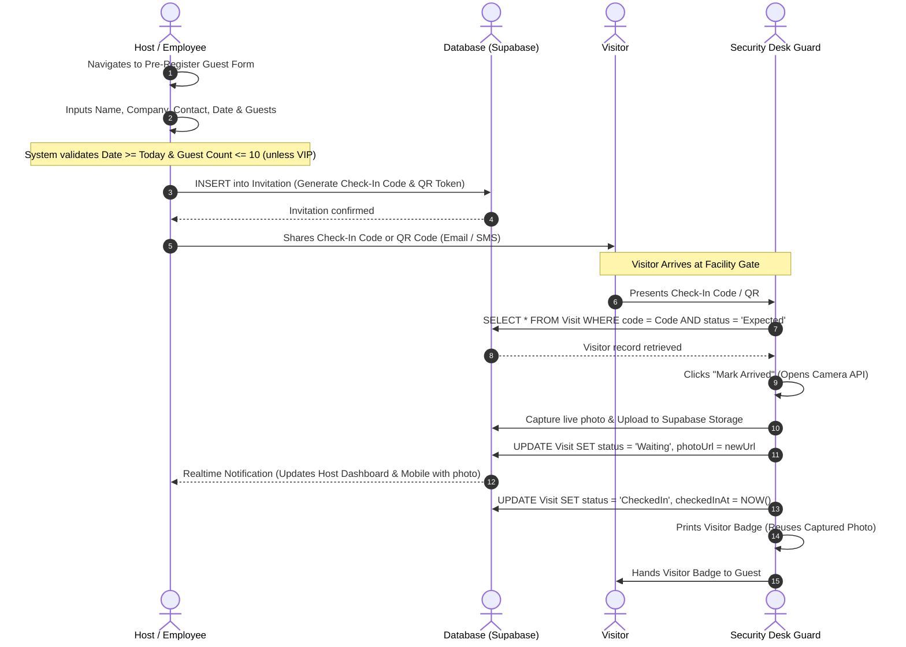
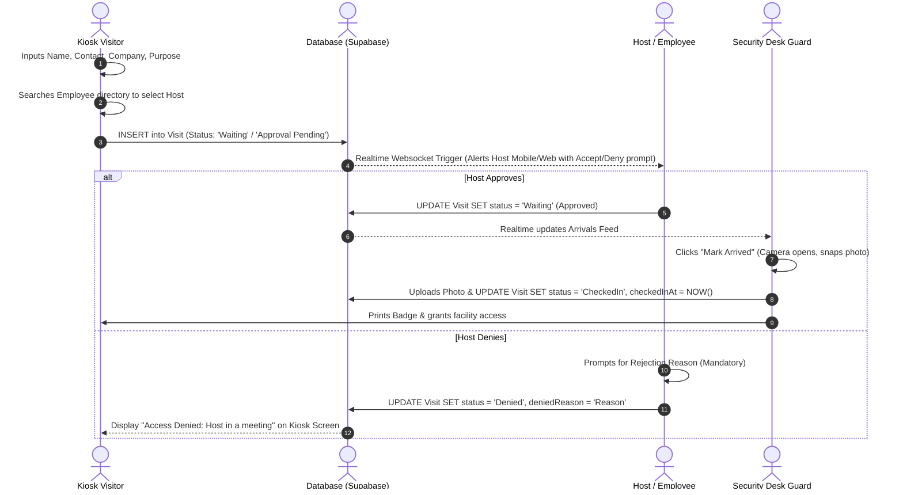
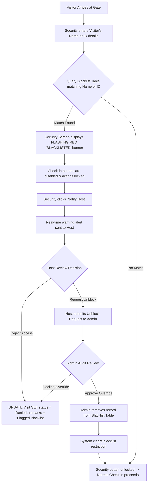
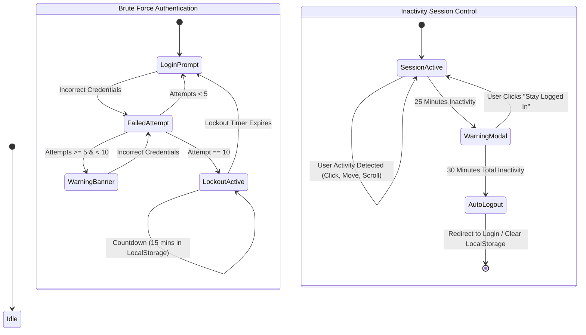
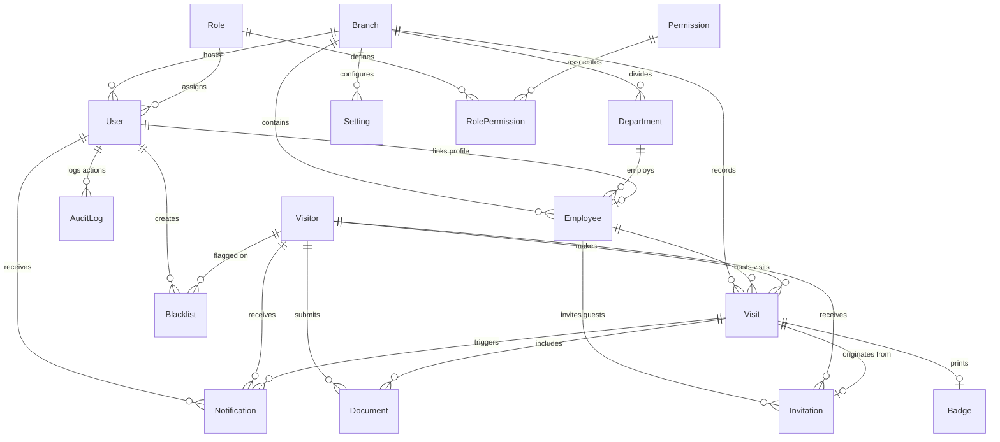

# Loomis Enterprise Visitor Management System (VMS) — Technical Blueprint & Operations Documentation

This document provides a comprehensive, developer-friendly guide detailing the architecture, tech stack, modular organization, configurations for styling adjustments, operational logic, real-time database schema, and native mobile container compilation of the Visitor Management System (VMS). It also highlights industry-standard features and provides structural logic flows (via Mermaid diagrams) for workflows and state-machines.

---

## 1. Directory Structure & Workspace Organization

The project is structured as an enterprise-grade **Turborepo monorepo** using npm workspaces. This enables separate applications to run in parallel while sharing configuration files, database ORM schemas, and TypeScript models.

```
Visitor_Mng_Sys/                     # Monorepo Root
├── apps/                            # Application Portals
│   ├── dashboard-ui/                # Web Dashboard for Admins, Hosts, and Security Desk (Vite + React)
│   │   └── src/
│   │       ├── App.tsx              # Main Dashboard Logic (Authentication, Views, Real-time streams)
│   │       ├── index.css            # Dashboard theme, styling variables, and core utility classes
│   │       └── supabaseClient.ts    # Client-side configuration and connection interface for Supabase
│   ├── mobile-ui/                   # Touch-friendly portal for Employees/Hosts on mobile (Vite + React)
│   │   └── src/
│   │       ├── App.tsx              # Mobile view logic, quick approvals, and host notifications
│   │       └── index.css            # Shared CSS variables & layout definitions for Mobile
│   ├── visitor-registration/        # Walk-in self-service tablet lobby kiosk (Vite + React)
│   │   └── src/
│   │       ├── App.tsx              # Walk-in registration forms, employee lists, and host selection
│   │       └── index.css            # Local Kiosk styles and responsive input forms
│   └── api-server/                  # Optional backend server & background notification engine (Express.js)
│       └── src/
│           ├── index.ts             # Main entry point and polling dispatcher (background alerts)
│           ├── routes/              # Auth, Visitors, Visits, Employees, and Analytics routers
│           └── middleware/          # JWT and role-based access controllers
├── packages/                        # Shared Workspace Modules
│   ├── database/                    # Shared Prisma Database Schema and Client
│   │   ├── prisma/
│   │   │   └── schema.prisma        # Definitive PostgreSQL Schema models and relationships
│   │   └── src/
│   │       └── index.ts             # Exports single shared PrismaClient instance
│   └── types/                       # Shared TypeScript definitions
│       └── src/
│           └── index.ts             # Common TS types (VisitStatus, VisitorType, User, Employee, etc.)
├── android-app/                     # Capacitor Native Android Project Container
│   ├── android/                     # Gradle configuration and Android Studio native code wrapper
│   ├── capacitor.config.json        # Capacitor sync config (points to apps/mobile-ui/dist)
│   ├── package.json                 # Scripts to compile mobile-ui and sync into native Gradle project
│   └── README.md                    # Setup and synchronization guide for native builds
├── turbo.json                       # Turborepo task relationships and caching rules
├── package.json                     # Monorepo workspaces, dependency scripts, and global runs
└── .env                             # Environment secrets (Supabase credentials, Database connection strings)
```

---

## 2. Core Tech Stack & Implementation Details

### 2.1 Web Applications
* **Framework**: React 18.2 with TypeScript 5.2, leveraging Vite 5.1 as the rapid build and hot-module replacement (HMR) development server.
* **Component-centric Layout**: Main pages leverage single-page-application (SPA) routing/states in monolithic `App.tsx` controllers for minimal rendering lag, fast sub-view swapping, and robust localStorage state management.
* **Icons**: `lucide-react` for modern, clean visual representation.
* **Analytics & Graphs**: `recharts` is used in the admin panel to display live visitor counts, trends, and host metrics.

### 2.2 Shared Package Layer
* **ORM (Object-Relational Mapping)**: Prisma ORM acts as the single source of truth for database migrations, model definitions, and queries.
* **Database**: PostgreSQL hosted on Supabase.
* **Database Driver**: `@prisma/client` instantiated dynamically inside `@vms/database` for use in backend environments.

### 2.3 Backend & Services
* **Express API Server**: Express.js with TypeScript (`api-server`) running standard REST routes. It features an automated background polling routine that queries the database every 10 seconds to dispatch queued email/SMS notifications.
* **Supabase Client SDK**: Frontends connect directly to Supabase (`@supabase/supabase-js`) for standard queries and mutations. Real-time updates utilize Supabase's database transaction websocket listeners (`supabase.channel(...)`).

### 2.4 Mobile App Container
* **Capacitor 6.0**: Turns standard web application builds into cross-platform native containers.
* **Capacitor Plugins**: `@capacitor/local-notifications` to trigger local system-level notification banners directly on host Android devices upon guest arrivals.

---

## 3. High-Fidelity Styling Configuration & Visual Customizations

The styling system is designed with a premium, state-of-the-art **Glassmorphism and HSL-based palette** that adapts between Light and Dark modes. The system does not use generic Tailwind utility overrides; instead, it relies entirely on **CSS Variables** defined in `:root`.

### 3.1 Styling Location
To modify the visual characteristics (color schemes, font families, text sizes, background blur details, etc.), locate the stylesheet:
* **Dashboard Portal**: `apps/dashboard-ui/src/index.css`
* **Mobile Portal**: `apps/mobile-ui/src/index.css`
* **Visitor Kiosk**: `apps/visitor-registration/src/index.css`

### 3.2 Visual Theme Tokens Reference
The following CSS properties (variables) defined in the `:root` block of `index.css` represent the core theme configurations:

| CSS Variable | Default Value | Purpose |
| :--- | :--- | :--- |
| `--font-sans` | `'Plus Jakarta Sans', system-ui, -apple-system, sans-serif` | Global Typography system |
| `--bg-dark` | `#fcfcfa` (Light) / `#141211` (Dark) | Overall page background color |
| `--indigo-primary` | `#e05a47` | Primary terracotta accent color (branding, primary buttons, logos) |
| `--indigo-hover` | `#c84e3c` (Light) / `#f07a68` (Dark) | Button/Link hover accent state |
| `--card-bg` | `rgba(255, 255, 255, 0.8)` (Light) / `rgba(28, 25, 23, 0.8)` (Dark) | Glassmorphic card opacity |
| `--card-border` | `#ebece6` (Light) / `#2e2a27` (Dark) | Warm-toned card borders |
| `--backdrop-blur` | `blur(4px)` | Glassmorphism blur index |
| `--status-expected` | `rgba(59, 130, 246, 0.08)` (Light) / `rgba(59, 130, 246, 0.15)` (Dark) | Expected badge background color |
| `--status-checkedin` | `rgba(16, 185, 129, 0.08)` (Light) / `rgba(52, 211, 153, 0.15)` (Dark) | Checked-in badge background color |
| `--status-waiting` | `rgba(245, 158, 11, 0.12)` (Light) / `rgba(245, 158, 11, 0.15)` (Dark) | Waiting badge background color |
| `--status-denied` | `rgba(239, 68, 68, 0.08)` (Light) / `rgba(248, 113, 113, 0.15)` (Dark) | Denied/Blacklisted badge background |

### 3.3 How to Change Typography or Color Schemes Manually
1. **Change Corporate Brand Accent**: Open the `index.css` files and modify the hex values for `--indigo-primary` and `--indigo-hover`. For instance, to change from terracotta to a deep emerald green:
   ```css
   --indigo-primary: #059669;
   --indigo-hover: #047857;
   ```
2. **Modify Font Family**: If you want to replace "Plus Jakarta Sans" with "Inter" or another Google Font:
   - Ensure the font is imported at the top of `index.css` via `@import`.
   - Update `--font-sans`:
     ```css
     --font-sans: 'Inter', system-ui, sans-serif;
     ```
3. **Adjust Glassmorphic Opacity/Blur**: For a heavier glass look, increase `--backdrop-blur` to `blur(12px)` and decrease the transparency in `--card-bg` from `0.8` to `0.5`.
4. **Local Spacing and Padding**: Local component layouts are styled using CSS classes like `.stat-card` (padding `24px`), `.top-navbar` (height `70px`), and `.page-container` (padding `32px`). Adjust these standard class rules in `index.css` directly to affect layout dimensions.

---

## 4. Multi-Environment Synchronization: How Two App Versions Run Simultaneously

### 4.1 Monorepo Orchestration
The monorepo coordinates the desktop dashboard (`dashboard-ui`), mobile dashboard (`mobile-ui`), self-registration portal (`visitor-registration`), and the API server (`api-server`) in parallel. When executing:
```bash
npm run dev
```
Turborepo reads `turbo.json` and runs all development scripts simultaneously.
- **Desktop Web Dashboard** serves on: [http://localhost:3000](http://localhost:3000)
- **Visitor Registration Kiosk** serves on: [http://localhost:3001](http://localhost:3001)
- **Mobile UI (Optimized Mobile view)** serves on: [http://localhost:3002](http://localhost:3002)
- **API Server backend** serves on: [http://localhost:5000](http://localhost:5000)

### 4.2 Real-time Data Synchronization Strategy
Rather than relying on resource-intensive database polling, both applications synchronize status changes instantly via **Supabase Real-Time Client Websockets**.
1. **Websocket Subscriptions**: When a client logs in (whether a security guard on a desktop or an employee on a mobile device), the application establishes a direct WebSocket channel to listen for PostgreSQL write-ahead logs (WAL) on the `Visit` table.
2. **Instant Propagation**:
   - A visitor checks in at the **Lobby Kiosk** (port 3001). This triggers a `POST` insertion to Supabase.
   - The Supabase database updates the record status.
   - The Real-Time server broadcasts the mutation event (`INSERT`/`UPDATE`) to all subscribed channels.
   - The **Security Dashboard** (port 3000) instantly adds the visitor to the arrivals grid.
   - The **Host's Mobile App** (port 3002 / Android Wrapper) instantly pops up an arrival notification, showing the guest's profile.

### 4.3 Capacitor Native Android Integration
To support hosts on the move who cannot remain at desktop terminals, the `mobile-ui` React app is compiled into a native Android app wrapper using **Capacitor**:
* **Web Build Compilation**: When compiled for Android, the code undergoes a production TypeScript compilation, and Vite builds static assets (HTML, CSS, JS) into `apps/mobile-ui/dist`.
* **Capacitor Bridge Sync**: Capacitor pulls the static build from `apps/mobile-ui/dist` (as defined in `android-app/capacitor.config.json`) and copies it into the native Android assets directory. It also maps native hardware APIs (like device notifications or local storage) to standard web browser APIs.
* **Compilation Pipeline**:
  ```mermaid
  flowchart LR
      src[mobile-ui/src/] -- Vite Build --> dist[mobile-ui/dist/]
      dist -- Capacitor Sync Bridge --> native[android-app/android/app/src/main/assets/]
      native -- Android Studio Gradle Build --> apk[VMS_Mobile.apk / Device Emulator]
  ```

---

## 5. Industry-Grade Premium Features

### 5.1 Row-Level Isolation (Enterprise Security Scope)
The database enforces strict branch-level scoping.
* Each user, employee, and visitor record belongs to a specific `branchId` (e.g., Bangalore HQ, Mumbai Office, Pune Office, Gurgaon Office).
* The UI automatically scopes all lists (Today's Arrivals, Expected List, Past Logs, Blacklist database) based on the logged-in user's `branchId`.
* This prevents cross-location data leakage, ensuring that a security guard in Pune cannot view visitor logs, company directories, or security alerts relevant to Bangalore.

### 5.2 Real-Time HTML5 Gate Verification Camera & Badge Reuse
To prevent badge fraud and verify identity:
* When a visitor arrives, security clicks **Mark Arrived**, which opens an HTML5 video stream using the browser camera API.
* Security snaps a live photo of the visitor.
* Once confirmed, the photo is stored in Supabase Storage and rendered instantly on the Host's dashboard (both Web and Mobile).
* Upon final sign-in, the system automatically imports this captured photo to generate the **Visitor Pass Badge**, bypassing the need for a secondary photo capture step.

### 5.3 Advanced Brute-Force Lockout Defense
To mitigate automated dictionary or brute-force login attempts:
* The login module monitors consecutive failed authentications per browser session using `localStorage`.
* **Attempt 5 to 9**: A red warnings banner displays showing remaining attempts.
* **Attempt 10**: The login form disables. A lockout state is set for **15 minutes**.
* The lockout is persisted using timestamps. Even if the user refreshes the page, a glassmorphic countdown timer blocks inputs, indicating the remaining lockout time.

### 5.4 Glassmorphic Inactivity Session Timeout
To secure unattended lobby computers or reception portals:
* The dashboard sets up window activity listeners (mouse movements, keypresses, clicks, scroll events).
* If a session has no user interaction for **25 minutes**, a glassmorphic modal overlays the screen, notifying the user that they will be logged out due to inactivity.
* If no interaction occurs within the next **5 minutes** (total 30 minutes of idle state), the system clears active sessions, terminates auth tokens, and redirects the client to the secure login page.

---

## 6. Project Architecture Alternatives

If you decide to scale, refactor, or migrate the system in the future, the following table lists the best industry alternatives to the current tech stack:

| Component | Current Stack | Best Alternative | Rationale for Alternative |
| :--- | :--- | :--- | :--- |
| **Monorepo Build** | Turborepo + NPM | **Nx Monorepo** | Nx offers deeper visual dependency graphs, advanced caching mechanisms, and robust code generation generators suited for large multi-team enterprise environments. |
| **Frontend Framework** | Vite + React SPA | **Next.js (App Router)** | Next.js offers Server-Side Rendering (SSR) and Incremental Static Regeneration (ISR). This optimizes the initial page load time and improves security by keeping database queries server-side. |
| **CSS System** | Vanilla CSS Variables | **Tailwind CSS v4** | Tailwind increases developer speed through standardized utility classes, making layouts more maintainable by removing bloated custom styles in `index.css`. |
| **Backend & ORM** | Direct Supabase Client + Prisma | **NestJS / Fastify + Prisma** | Moving Supabase operations behind a NestJS API provides a clean gateway. This isolates the database schema, handles validation decorators (`class-validator`), and implements robust microservices. |
| **Real-time Engine** | Supabase Realtime | **Socket.io / Redis PubSub** | For high-scale deployments, managing custom WebSockets using Socket.io backed by a Redis pub-sub adapter offers custom message formats, channel logic, and horizontal scaling. |
| **Mobile Integration** | Capacitor Wrapper | **React Native / Expo** | While Capacitor wraps web assets, React Native compiles native Android/iOS UI widgets. This provides smoother scroll metrics, gesture handling, and native widget performance. |
| **Database** | Supabase Postgres | **CockroachDB / AWS Aurora Serverless** | For multi-region scale, CockroachDB offers distributed replication, low latency across different countries, and automatic failovers. |

---

## 7. System Logic Flows & Logic Blueprints

These structured text descriptions and Mermaid flows are designed to be copied directly into graphic modeling software (like Mermaid.live, draw.io, or Lucidchart) to produce diagrams.

### 7.1 Pre-Registration Flow
This flow details how hosts pre-schedule guests, who then enter the facility using a check-in code.



### 7.2 Walk-in Registration Flow
This flow details how unexpected guests sign-in at the lobby kiosk tablet and wait for host approval.



### 7.3 Blacklist Enforcement & Override Flow
This logic prevents flagged individuals from entering, and outlines how the lockout is handled.



### 7.4 Security Lockout & Inactivity State Machine
This state machine controls browser-side brute-force defense and terminal lockouts.



### 7.5 Database Relationship Blueprint
This diagram maps out the relational database tables, keys, and associations based on the Prisma Schema:



---
*Loomis Visitor Management System — Technical Operations Reference*
