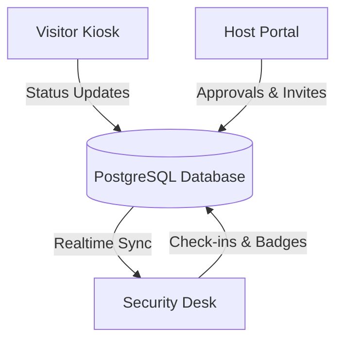
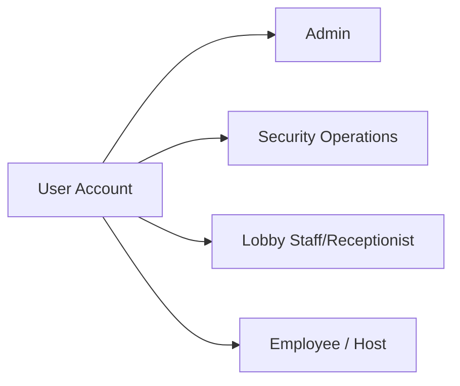
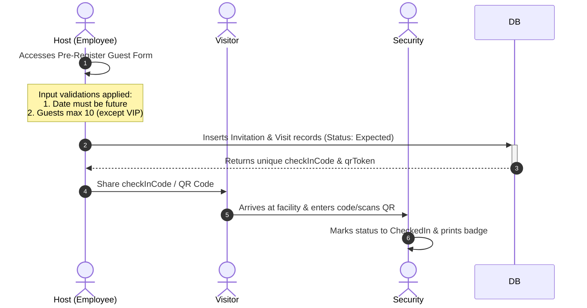
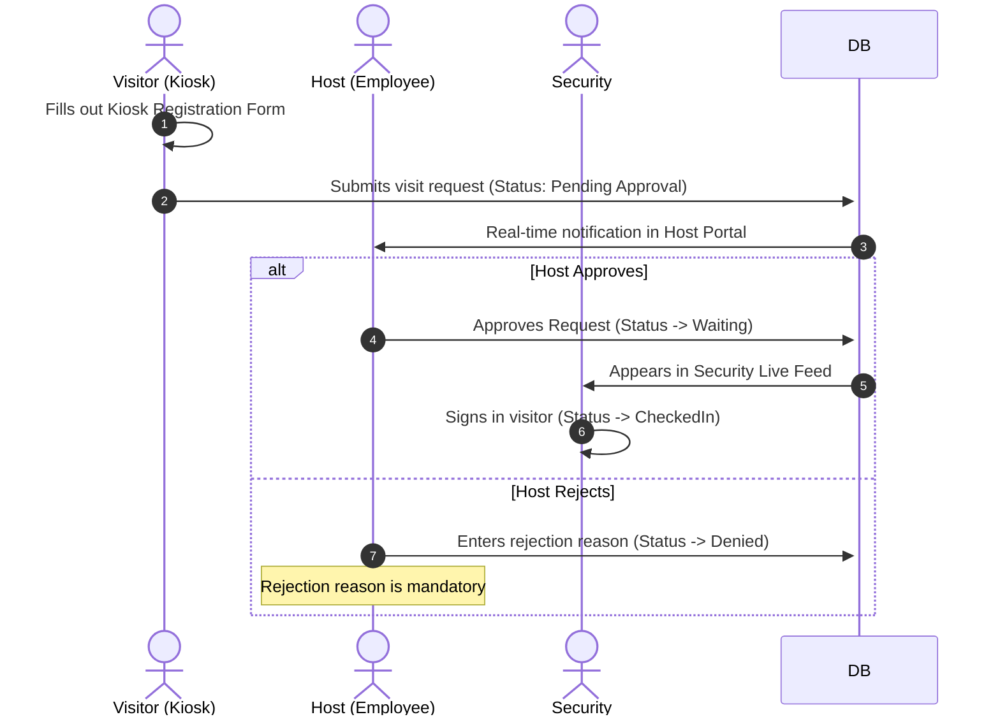
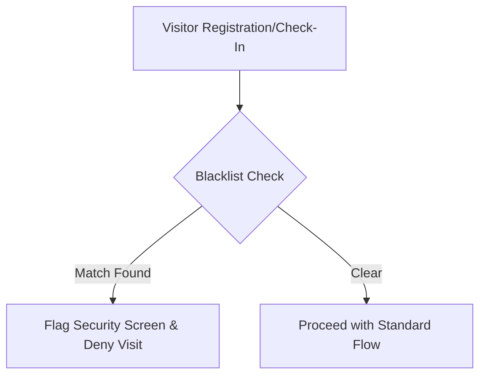

# Product Requirements Document (PRD)
## Enterprise Visitor Management System (VMS) — v1.0.0

---

## 1. Document Control & Metadata

| Field | Detail |
| :--- | :--- |
| **Document Title** | Product Requirements Document (PRD) — Visitor Management System (VMS) |
| **Authors** | Antigravity AI & Loomis VMS Core Engineering Team |
| **Status** | **Approved / Active** |
| **Created Date** | July 15, 2026 |
| **Version** | `1.0.0` |
| **Target Platforms** | Web (Visitor Kiosk, Host Portal, Security Desk) & Android Mobile App |
| **Workspace Architecture** | Turborepo Monorepo (React Frontend, Express Backend, Prisma DB Client, Capacitor Android Wrapper) |

---

## 2. Executive Summary & Vision

The **Loomis Enterprise Visitor Management System (VMS)** is a high-performance, secure, and real-time physical visitor administration application. It replaces manual paper sign-in sheets with a digitized lobby management system that coordinates actions between **unattended kiosks**, **host employees**, and **security officers**. 

The system is designed for multi-tenant branch locations, utilizing **Supabase Realtime subscriptions** to synchronize status changes across desks instantly. It incorporates strict enterprise-grade security protocols, including **Role-Based Access Control (RBAC)**, **Tiered Authentication Lockouts**, **Idle Session Lockouts**, and automated **Blacklist Restrictions**.



---

## 3. Goals & Key Objectives

1. **Seamless Lobby Operations**: Enable visitors to check in within 30 seconds using pre-registration QR/numerical codes or walk-in registration.
2. **Real-Time Synchronicity**: Establish instant, zero-refresh queue updates at the Security Desk when visitors arrive or status updates occur.
3. **Enterprise Security Gates**: Enforce multi-tier defensive auth restrictions to safeguard security desk terminals and kiosk panels from unauthorized access and brute-force attacks.
4. **Data Integrity & Traceability**: Maintain detailed audit logs of all registration, check-in, checkout, and blacklisting operations.
5. **Multi-Branch Capability**: Support localized settings, department configurations, and timezone-aware operational flows for multiple offices (e.g., Bangalore, Mumbai, Pune, Gurgaon).

---

## 4. System Architecture & Technology Stack

The project is structured as a **Turborepo monorepo** to maximize build optimizations and share code packages between the user-facing interface and the API gateway.

```
Visitor_Mng_Sys/ (Monorepo Root)
├── apps/
│   ├── dashboard-ui/        # React + Vite + TypeScript Frontend Dashboard
│   └── api-server/           # Node.js + Express + TypeScript Backend API Server
├── packages/
│   ├── database/             # Prisma Schema, Database Client, and Migrations
│   └── types/                # Shared Domain and Database Type Definitions
└── android-app/             # Capacitor Wrapper for Android Mobile Application
```

### 4.1 Technology Stack Details

* **Frontend Framework**: React 18, Vite, TypeScript.
* **Design System**: Custom Terracotta & Warm Cream theme with glassmorphic modals, styled using Vanilla CSS variables.
* **Database & ORM**: PostgreSQL database, managed through Prisma Client.
* **API Server**: Express.js, TypeScript, Node.js.
* **Real-time Sync**: Supabase Realtime client interface for immediate server-to-client updates.
* **State Management**: React Context, Hooks, and client-side memory states.

---

## 5. User Roles & Persona Profiles

The system enforces four distinct user roles, mapped to database security configurations:



### 5.1 Admin
* **Description**: Global or branch-level system administrators.
* **Capabilities**: Can manage system settings, add/remove employee directories, modify branch locations, configure global rules, override blacklists, and audit system logs.

### 5.2 Security Operations
* **Description**: Lobby security personnel or facility guards.
* **Capabilities**: Manages the live arrivals feed, performs visitor identity checks, prints physical badges, registers security flags, uploads visitor identification documents, and executes check-ins/checkouts.

### 5.3 Lobby Staff / Receptionist
* **Description**: Front desk receptionist assisting walk-ins.
* **Capabilities**: Reads visitor schedules, helps register walk-in guests, and coordinates meeting rooms.

### 5.4 Employee / Host
* **Description**: Corporate staff members hosting visits.
* **Capabilities**: Pre-registers visitors (invites), receives live walk-in approval requests, and manages their own visit logs.

---

## 6. Functional Requirements & Key User Workflows

### 6.1 The Pre-Registration Workflow (Host-Initiated)

Allows hosts to pre-schedule visits, ensuring security has full visibility of upcoming arrivals.



* **Validation Rules**:
  * **Date Validity**: Invitation date cannot be in the past.
  * **Visitor Cap**: Up to `10` guests permitted per invitation. This limit is bypassed only if the classification is set to `VIP`.
  * **Unique Tokens**: Generates a cryptographically unique `qrToken` (UUID) and a simplified `checkInCode` (dashed monospace code).

---

### 6.2 The Walk-In Registration Workflow (Visitor-Initiated)

Handles spontaneous visitors who arrive without a pre-existing invitation.



* **Validation Rules**:
  * **Mandatory Host Selection**: Visitors must select an active employee from the directory.
  * **Mandatory Rejection Reason**: Hosts cannot reject a walk-in request without documenting a reason (`deniedReason` column).
  * **Identity Rules**: Profiles are matched based on `Name + (Email or Phone)` to avoid merging distinct visitors with identical names.

---

### 6.3 Security Desk Operations & Badge Issuance

The central command dashboard used by security guards.

* **Today's Arrivals Feed**: Shows visitors with check-in activity or schedules matching the *current calendar date* (Statuses: `Expected`, `Waiting`, `CheckedIn`, `InMeeting`).
* **Check-In Gate**: Security reviews visitor details, verifies identification documents (e.g., NDA, ID, Permit), updates status to `CheckedIn`, and issues a badge.
* **Badge Printer Engine**: Generates a physical card containing:
  * Guest name, visitor type (VIP, Guest, Vendor, Contractor).
  * Visit purpose and host name.
  * Unique `badgeNumber` and date.
  * Print counter (increments on reprints).
* **Checkout Gate**: Upon departure, security clicks **Checkout** (Status -> `CheckedOut`).

---

### 6.4 Blacklist Control & Identity Enforcement

A defense mechanism preventing unwanted individuals from scheduling or gaining access.



* **Database Lookup**: Compares visitors against the `Blacklist` table by matching name and document number.
* **Real-time Alerting**: Instantly displays red security banners on the security panel if a match is identified.
* **Administrative Override**: Only an authorized `Admin` can update, lift, or configure blacklist profiles.

---

## 7. Security & Non-Functional Requirements

### 7.1 Tiered Authentication & Lockout Protection

Protects dashboard terminals from brute-force attempts.

| Tier | Protection Gate | Trigger Condition | Enforcement Mechanism |
| :--- | :--- | :--- | :--- |
| **Tier 1** | **Email Lockout** | 5 consecutive failed logins on an email. | Locks email globally for 15 minutes. |
| **Tier 2** | **Math CAPTCHA** | 3 failed attempts in a browser window. | Displays a glassmorphic captcha challenge before allowing submission. |
| **Tier 3** | **IP Rate Limit** | 10 failed attempts from a network IP. | Blocks IP on API Gateway for 15 minutes. |

---

### 7.2 Inactivity Session Lockout

Secures unattended computer terminals left open by staff.

* **Idle Time Tracking**: Captures user inactivity (no clicks, scroll, keys) via frontend event listeners.
* **Warning Threshold**: After **25 minutes** of inactivity, displays a glassmorphic warning modal with a 5-minute countdown.
* **Lockout Threshold**: At **30 minutes**, automatically invalidates the user session, clears local storage tokens, and redirects to the login screen.

---

### 7.3 Data Isolation & Row-Level Security (RLS)

* **Access Control**: Database schema enforces Postgres policies to restrict data access by role.
* **Multi-Branch Isolation**: Limits user visibility to records within their own branch (`branchId`), preventing accidental cross-location data exposure.

---

## 8. Database Schema Definition

The PostgreSQL database uses the following relational structure, managed via Prisma ORM:

### 8.1 Enumerated Types

#### `VisitorType`
* Defines classifications for visitors:
  * `Guest`, `Vendor`, `Contractor`, `Candidate`, `VIP`, `Emergency`

#### `VisitStatus`
* Defines states of a visit request:
  * `Expected`, `CheckedIn`, `Waiting`, `InMeeting`, `CheckedOut`, `Denied`, `Cancelled`

#### `NotificationChannel`
* Defines communication methods:
  * `Email`, `SMS`, `Push`, `InApp`

#### `NotificationStatus`
* Defines delivery states:
  * `Queued`, `Sent`, `Failed`, `Read`

#### `DocumentType`
* Defines uploaded attachment types:
  * `ID`, `NDA`, `Permit`, `Insurance`, `Other`

#### `SeverityLevel`
* Defines blacklist severity:
  * `Low`, `Medium`, `High`

---

### 8.2 Models and Tables

#### `Role` & `Permission`
Manages Role-Based Access Control (RBAC).
* **`Role`**: `id` (UUID), `name` (String, unique), `description` (String), `isSystemRole` (Boolean).
* **`Permission`**: `id` (UUID), `code` (String, unique), `description` (String).
* **`RolePermission`**: Join table mapping roles to permissions (composite primary key `[roleId, permissionId]`).

#### `Branch`
Represents physical facility offices.
* `id` (UUID), `name` (String), `address` (String), `timezone` (String), `isActive` (Boolean).

#### `Department`
Corporate division structure.
* `id` (UUID), `name` (String), `branchId` (UUID, Foreign Key).

#### `User`
Main account table for dashboard logins.
* `id` (UUID), `email` (String, unique), `passwordHash` (String), `fullName` (String), `roleId` (UUID), `branchId` (UUID), `phone` (String), `isActive` (Boolean), `mfaEnabled` (Boolean), `lastLoginAt` (DateTime).

#### `Employee`
System host directory for visitors.
* `id` (UUID), `fullName` (String), `email` (String, unique), `phone` (String), `floor` (String), `isActive` (Boolean), `departmentId` (UUID), `branchId` (UUID).

#### `Visitor`
Profile record for guests.
* `id` (UUID), `fullName` (String), `email` (String), `phone` (String), `photoUrl` (String), `idDocumentType` (String), `idDocumentNumber` (String), `company` (String), `visitorType` (Enum), `isBlacklisted` (Boolean).

#### `Visit`
Transactional logs tracking physical visits.
* `id` (UUID), `visitorId` (UUID), `hostEmployeeId` (UUID), `invitationId` (UUID, nullable), `branchId` (UUID), `purpose` (String), `status` (Enum), `scheduledAt` (DateTime), `checkedInAt` (DateTime), `checkedOutAt` (DateTime), `deniedReason` (String), `zoneAccess` (String), `remarks` (String), `additionalGuests` (Int).

#### `Invitation`
Pre-registered guest credentials.
* `id` (UUID), `visitorId` (UUID), `hostEmployeeId` (UUID), `qrToken` (String, unique), `scheduledAt` (DateTime), `expiresAt` (DateTime).

#### `Badge`
Physical printed identifier tracker.
* `id` (UUID), `visitId` (UUID, unique), `printedAt` (DateTime), `printCount` (Int), `badgeNumber` (String, unique).

#### `Blacklist`
Restricted profile directory.
* `id` (UUID), `visitorId` (UUID), `fullName` (String), `idDocumentNumber` (String), `reason` (String), `severity` (Enum), `addedByUserId` (UUID).

#### `AuditLog`
Detailed operational logging.
* `id` (UUID), `actorUserId` (UUID), `action` (String), `entityType` (String), `entityId` (String), `beforeState` (JSON), `afterState` (JSON), `ipAddress` (String).

---

## 9. API Specifications (Express Gateway)

All backend endpoints are prefixed with `/api/v1/`.

### 9.1 Authentication Router (`/api/v1/auth`)
* `POST /login`: authenticates dashboard credentials, increments lockouts on failure.
* `POST /register`: seeds new administrative/employee users.
* `GET /me`: returns authenticated token properties and permissions.
* `GET /check-lockout`: queries whether an IP or email address is locked out.

### 9.2 Visitors Router (`/api/v1/visitors`)
* `GET /`: returns paginated lists of visitors.
* `GET /:id`: gets historical data for a specific visitor profile.
* `POST /blacklist`: flags a visitor record and updates security parameters.
* `POST /verify`: checks if credentials match existing user/visitor directories.

### 9.3 Visits Router (`/api/v1/visits`)
* `POST /`: schedules a new pre-registration or registers a walk-in.
* `POST /check-in`: signs a visitor in, changing status to `CheckedIn` and generating a badge record.
* `POST /check-out`: executes a checkout, changing status to `CheckedOut`.
* `POST /approve`: host-approved endpoint for walk-in arrivals.
* `POST /reject`: host-rejected endpoint (requires `deniedReason`).

### 9.4 Analytics Router (`/api/v1/analytics`)
* `GET /summary`: returns statistics on check-ins, VIP visits, and active guests.
* `GET /daily-counts`: returns counts grouped by date for dashboard graph widgets.

---

## 10. Future Enhancements & Hardening Roadmap

To prepare this application for high-availability enterprise environments, the following milestones are recommended:

1. **Distributed Lockout Storage**: Migrate email and IP lockout tracking from local API server memory to a shared **Redis cache instance** to support horizontal scaling.
2. **Database-Driven Audit Logs**: Move audit logging out of direct client-side requests. Enforce logging automatically using PostgreSQL triggers or backend middleware.
3. **Notification Integration**: Replace the simulated log dispatcher with production connectors for **Twilio** (SMS Alerts) and **Sendgrid / AWS SES** (Email Alerts).
4. **Strong Password Policies**: Enforce password requirements (minimum 12 characters, uppercase/lowercase, special characters, and digits) on registration.
5. **Secure Database Writes**: Tunnel all read and write queries through the API gateway rather than allowing direct Supabase calls from the frontend, ensuring unified schema validation.

---
*End of PRD. Loomis VMS Engineering Group.*
