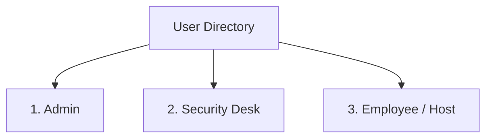
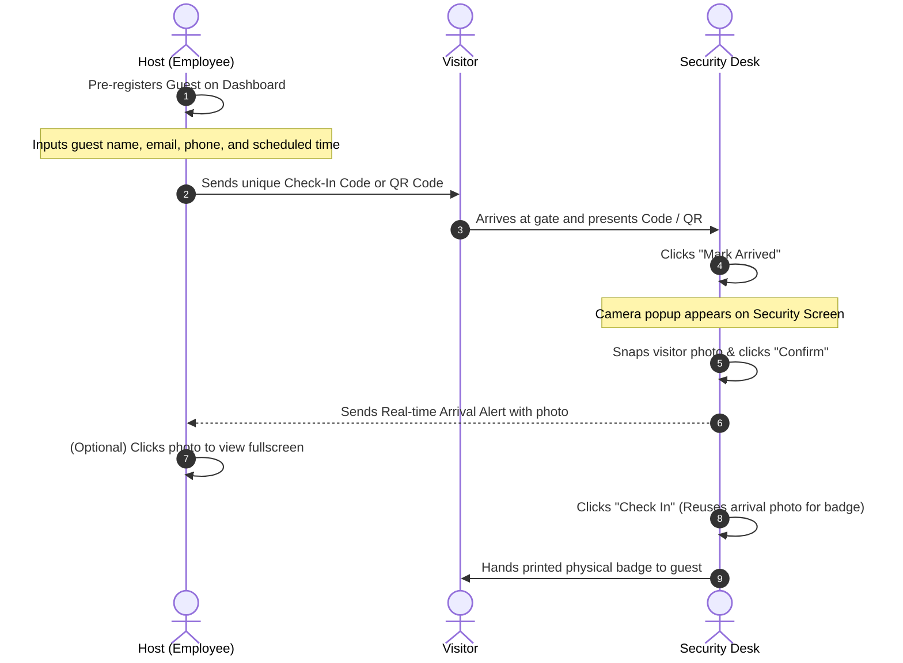
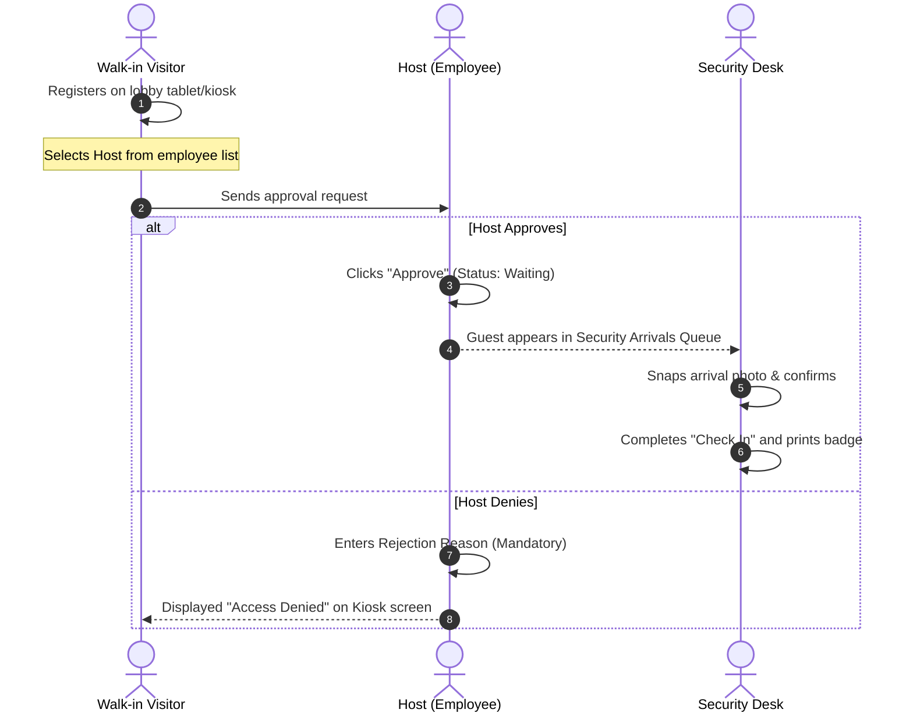
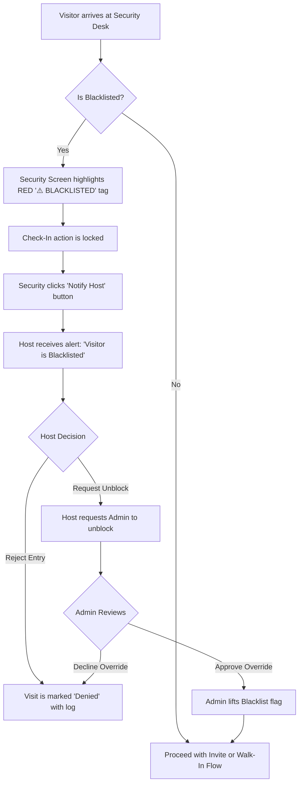

# Product Requirements Document (PRD)
## Enterprise Visitor Management System (VMS) — v1.1.0

---

## 1. Document Control & Metadata

| Field | Detail |
| :--- | :--- |
| **Document Title** | Product Requirements Document (PRD) — Visitor Management System (VMS) |
| **Authors** | Antigravity AI & Loomis VMS Core Engineering Team |
| **Status** | **Active / Updated** |
| **Date** | July 21, 2026 |
| **Version** | `1.1.0` |
| **Target Platforms** | Web Dashboard (Admin Portal, Host Panel, Security Desk) & Android Mobile App |
| **Workspace Architecture** | Turborepo Monorepo (Web Dashboard, Mobile App UI, API Server, Shared DB Schema) |

---

## 2. Overview & Product Vision

The **Loomis Enterprise Visitor Management System (VMS)** is a modern lobby administration system that connects corporate hosts, lobby security teams, and guests. It replaces old paper logbooks with a real-time, highly secure, and automated digital sign-in pipeline.

The system is deployed across multiple branch offices (e.g., Bangalore, Mumbai, Pune, Gurgaon). To ensure optimal usability:
1. **Web Dashboard (`dashboard-ui`)**: Optimized for desktop monitors with a persistent left-hand sidebar navigation, catering to Admins, Security, and Employees using desktop computers.
2. **Mobile App (`mobile-ui`)**: Wrapped in a Capacitor container for Android, giving Employees/Hosts on-the-go access to coordinate guest approvals, receive arrival alerts, view visitor photos, and handle blacklisted warning signals.

---

## 3. Core User Roles & Personas

The system focuses on three distinct roles, completely omitting legacy or global admin configurations:

### 3.1 Admin
* **Who they are**: Local branch office administrators.
* **Responsibilities**:
  * Manage branch configurations and employee directories.
  * Audit active visitor queues and past entry logs.
  * Oversee and lift Blacklist restrictions if necessary.

### 3.2 Security Desk
* **Who they are**: Lobby guards and security personnel at physical gates.
* **Responsibilities**:
  * Monitor the live daily arrivals feed.
  * Click photo verification of arriving guests at the gate.
  * Issue printed physical badges for verified guests.
  * Check in and check out visitors as they enter or exit.

### 3.3 Employee / Host
* **Who they are**: General office employees who invite guests.
* **Responsibilities**:
  * Pre-register visitors (generate invitations).
  * Approve or deny walk-in registration requests in real time.
  * Receive instant alerts (with photos) when their guests arrive.
  * Handle unblocking request workflows for flagged visitors.

---

## 4. Workflows & Visitor Journeys

### 4.1 Pre-Registration Workflow (Host-Initiated)

This workflow applies to scheduled guests who receive an invite code prior to arrival.

1. **Invitation Creation**: The Host enters the guest's contact info. The system generates a clean check-in code and unique QR token.
2. **Visitor Arrival**: The visitor presents their code to Security.
3. **Arrival Photo Capture**: Security clicks **Mark Arrived**. Instead of checking them in directly, a camera interface opens. Security snaps a quick picture of the visitor.
4. **Host Alert**: Confirming the photo changes the visit status to `Waiting` and fires an instant alert to the Host containing the snapped photo.
5. **Fullscreen Review**: The Host receives the alert and can click on the visitor's photo to open it in a larger window.
6. **Pass Generation**: When Security clicks **Check In**, the system reuses the captured photo automatically, bypassing the need for a second photo capture.

---

### 4.2 Walk-In Registration Workflow (Kiosk-Initiated)

This workflow applies to unexpected visitors who arrive at the lobby kiosk.

1. **Kiosk Sign-in**: The walk-in visitor enters their details on the lobby kiosk and selects their Host.
2. **Approval Gateway**: The Host gets an instant notification requesting approval.
   * If **Approved**: The visitor is added to the Security Arrivals queue.
   * If **Denied**: The Host must input a reason (e.g., *"In a meeting"*), and the visitor is notified of the rejection.
3. **Arrival Verification**: Once approved, Security follows the same photo capture and badge printing check-in flow as pre-registered visitors.

---

## 5. Blacklist Control & Flagging Flows

The blacklist prevents unauthorized or flagged individuals from entering the premises.

1. **Visual Alerts**: If a visitor matching a blacklist profile (checked by name/contact credentials) arrives, the Security desk displays a red `⚠️ BLACKLISTED` badge.
2. **Action Lockout**: The standard check-in button is disabled. Security cannot sign the guest in.
3. **Notify Host**: Security clicks the **Notify Host** button. This sends an alert to the host indicating that a blacklisted guest has arrived.
4. **Host Options**:
   * **Reject Entry**: Denies the guest. The visit status is updated to `Denied` in the logs.
   * **Request Unblock**: If the host believes this is an error or wants to clear the guest, they submit a request to the **Admin**.
5. **Admin Override**: Only an **Admin** has the security clearance to remove the visitor from the blacklist, allowing them to be checked in.

---

## 6. How the Mobile App Enhances Workability

The mobile workspace (`apps/mobile-ui`) is designed to support hosts on the move:

* **Mobility**: Employees are rarely sitting at desktop computers when visitors arrive. The mobile app allows them to manage invites and approve walk-ins from anywhere in the facility.
* **Instant Photo Notifications**: When Security captures a visitor's photo at the gate, it is transmitted in real time to the host's phone. Hosts can inspect who is waiting for them in the lobby instantly.
* **Direct Blacklist Resolution**: If a visitor is flagged, hosts receive notification banners on their mobile devices immediately, enabling quick rejection or unblock escalations.
* **Optimized UI**: Simple, single-column dashboard cards designed for quick touch actions.

---

## 7. Interface Design & Aesthetics

The VMS layout prioritizes clear, visual cues to help security and staff make split-second decisions:
* **Glassmorphism**: Modals hover over the screens with clean blur filters, making it easy to focus on popups (like the camera capture screen).
* **Vibrant Indicators**:
  * Green badges signify a checked-in guest.
  * Orange/Yellow buttons denote wait periods or unblocking alerts.
  * Red indicators represent blacklisted warnings.
* **Fullscreen Photo Viewer**: Hosts or security guards can click on any thumbnail to expand the captured image into a full-sized popup, making identity checks simple.

---
*End of PRD. Loomis VMS Engineering Group.*
