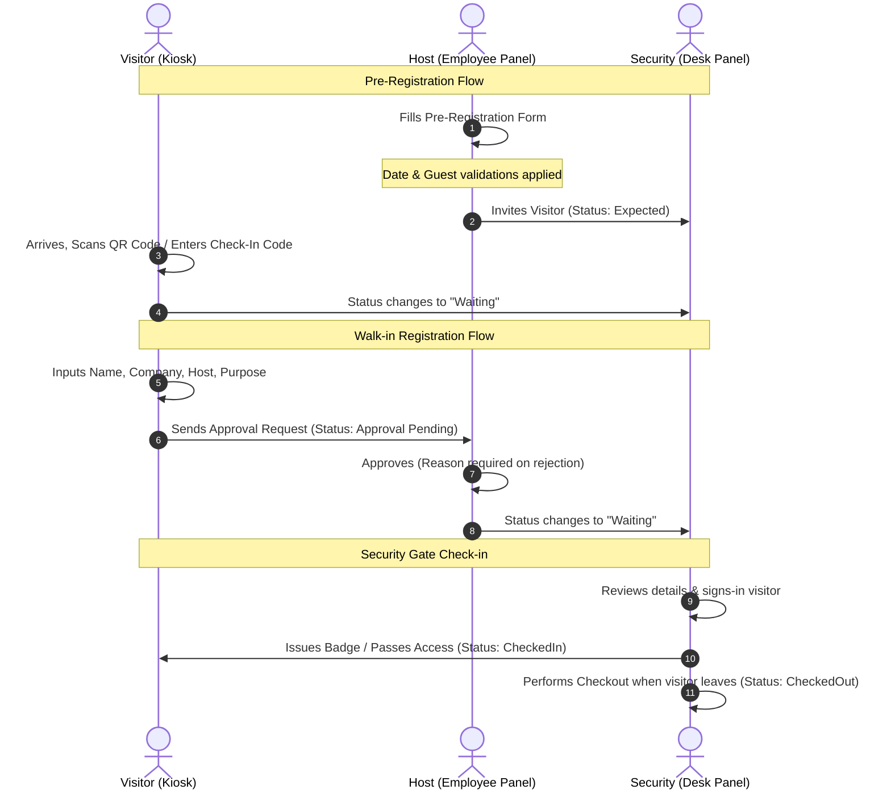

# Enterprise Visitor Management System (VMS) — Walkthrough & Operations Guide

This guide describes how to run the Visitor Management System locally, its core system flows, and the interactive step-by-step visitor lifecycles.

---

## 1. How to Run the Application Locally

The VMS application is structured as a **Turborepo monorepo** containing the following workspace components:
1. `dashboard-ui` (Vite + React frontend running on port `3000`)
2. `api-server` (Express backend running on port `3001` - optional, as the dashboard connects directly to Supabase via client-side API)
3. `android-app` (Capacitor Android wrapper to compile and build the Android application)

### 1.1 Prerequisites
Ensure you have the following installed:
- **Node.js** (v18 or higher)
- **npm** or **yarn**
- **Android Studio** (for the Android application wrapper)

### 1.2 Running Development Servers
From the root directory, execute:
```bash
npm run dev
```
This runs the Vite development server for the `dashboard-ui`.
- **Frontend Dashboard Address:** [http://localhost:3000](http://localhost:3000)

---

## 2. Interactive Visitor Lifecycles & Flows

The VMS coordinates actions between three portals: **Visitor Kiosk**, **Host/Employee Panel**, and **Security Desk**.



### 2.1 The Pre-Registration Flow
1. **Host Action:** An employee logs into the dashboard (e.g. using `sarah.j@vms.local` / `Employee@123`).
2. **Invitation Creation:** They navigate to the **Pre-Register Guest** form, input details (name, email, phone, purpose, date/time, and guest count), and submit.
   - *Validation Gate:* Past dates cannot be selected.
   - *Validation Gate:* Number of guests is capped at `10` unless the classification is set to `VIP`.
3. **Arrival:** The guest receives their invitation. Upon arriving at the kiosk, they enter their unique check-in code.
4. **Security Check-In:** The guest's record changes to `Waiting` in the Security Arrivals feed. Security clicks **Check-In** to sign them into the facility.

### 2.2 The Walk-in Registration Flow
1. **Visitor Kiosk:** A walk-in visitor registers at the lobby kiosk.
2. **Approval Request:** They select their Host from the database directory. The visit status is set to `Pending Approval`.
3. **Host Notification:** The Host receives an approval prompt on their dashboard.
   - If **Approved**, the status advances to `Waiting`.
   - If **Rejected**, the Host must enter a mandatory rejection reason, and the status changes to `Denied`.
4. **Badge Issuance:** Security checks the guest in, printing their badge and granting facility entrance.

### 2.3 Security Desk arrivals and Past Records
- **Today's Arrivals Feed:** Displays ONLY visitors scheduled or checked in for the *current calendar date*.
- **Check Invitations:** Displays all upcoming/future visitor invitations.
- **Past Records:** Displays all historical visitor logs (Checked Out, Denied, or Cancelled).

---

## 3. Security Protections & Session Management

1. **Brute-Force Lockout:**
   - Tracks failed login attempts per browser window using `localStorage`.
   - After **5 failed attempts**, a reminder displays the remaining attempts.
   - After **10 failed attempts**, the user is locked out for **15 minutes**. A real-time countdown timer blocks login inputs.

2. **Inactivity Session Timeout:**
   - The dashboard monitors mouse movements, key presses, and clicks.
   - If inactive for **25 minutes**, a glassmorphic warning modal prompts the user.
   - If no activity is detected by **30 minutes**, the user is automatically logged out.

---

## 4. Running the Android Application Wrapper

To build and run the Android app without touching the web codebase:
1. **Sync and copy assets**:
   ```bash
   npm run android:sync --workspace=vms-android
   ```
2. **Open the project in Android Studio**:
   ```bash
   npm run android:open --workspace=vms-android
   ```
3. Run the project on your emulator/device directly from Android Studio. Detailed setup and options can be found in the [Android README](file:///c:/Users/Div/Desktop/ANTIGRAVITY/VMS_1.0/android-app/README.md).
